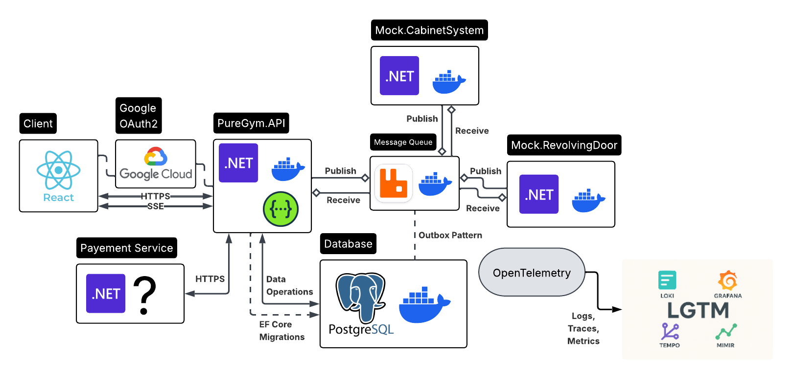

# 🏋️ PureGym Management System (v1)

A system design and implementation of a 24/7 gym, featuring multiple locations and hardware entities.

This project follows **Clean Architecture** and its constraints, utilizing **CQRS** and **Event-Driven Architecture** to ensure high scalability and domain decoupling.

---

## 🏛️ System Architecture

Below is the C4 Level 2 (Container) diagram illustrating the high-level architecture, component interactions, and data flow of the PureGym Management System.

---

## 💻 Tech Stack

| Component | Technology | Description |
| :--- | :--- | :--- |
| **Backend** | .NET 10 | Core API and business logic |
| **Frontend** | React | User interface and client-side application |
| **Database** | PostgreSQL | Primary relational data store |
| **Messaging** | RabbitMQ | Message broker for asynchronous event handling |
| **Infrastructure** | Docker | Containerization for deployment and local development |
| **Observability**| LGTM Stack | Loki, Grafana, Tempo, and Mimir for comprehensive telemetry |

---

## 🚀 Key Features

* **Event-Driven Architecture:** Implements the Outbox pattern to safely decouple the core API from physical door access hardware.
* **Comprehensive Observability:** Full LGTM tracing spans the entire request lifecycle (React Client -> .NET API -> RabbitMQ -> Hardware Mock).
* **Real-Time Feedback:** Utilizes Server-Sent Events (SSE) to push live updates and access statuses directly to the client.

---

## 🏗️ Architecture Decision Records (ADRs)

We document significant design decisions to track the project's evolution:

| ID | Title | Status |
|:---|:---|:---|
| [001](./docs/adr/ADR_001.md) | **Async Hardware Decoupling** | Accepted |
| [002](./docs/adr/ADR_002.md) | **PostgreSQL as Primary Store** | Accepted |
| [003](./docs/adr/ADR_003.md) | **Omission of Distributed Cache** | Accepted |
| [004](./docs/adr/ADR_004.md) | **LGTM Stack for Telemetry** | Accepted |
| [005](./docs/adr/ADR_005.md) | **Server-Sent Events (SSE) for Real-Time Feedback** | Accepted |

---

## 📐 Specifications

* **[Functional Specification (PDF)](./docs/specs/pure_gym_fs_v1.pdf):** A formal breakdown of the key features, business rules, and requirements of the system.